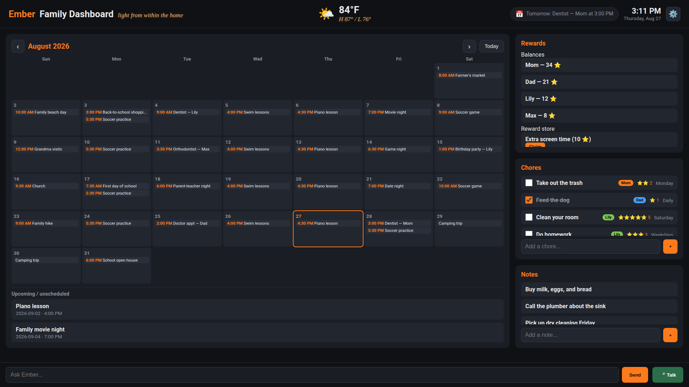
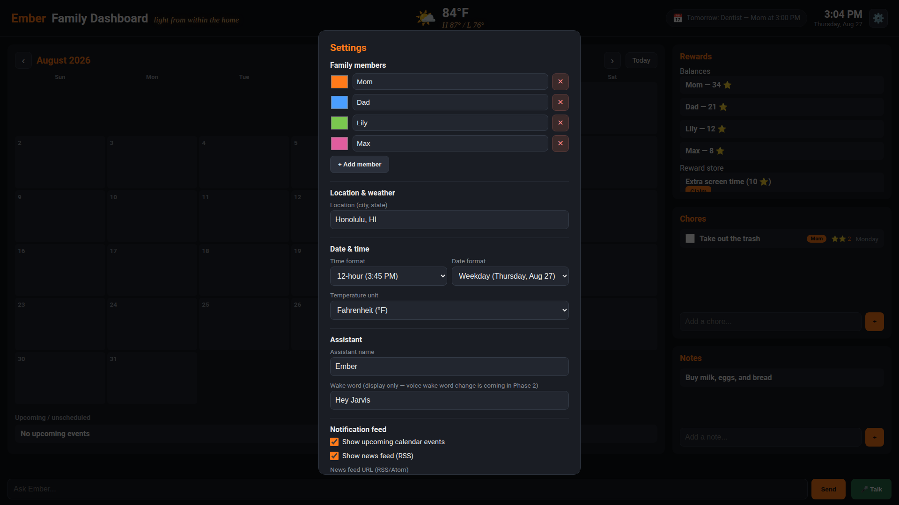

# Ember Family Dashboard

> *Light from within the home.*

A self-hosted, wall-mounted family dashboard with a voice assistant. Take an old
unused touchscreen laptop or tablet, point it at the wall, and turn it into the
heart of the home — no cloud, no subscription, no lock-in.

Runs on a CPU-only Linux kiosk (no GPU, no telephony, no cloud). Wake word → mic
→ STT → LLM → TTS, plus a touch-friendly on-screen keyboard and a full family
board: calendar, chores, notes, star-powered rewards, live weather, a rotating
notification feed, a photo screensaver, shared lists, and meal planning.

Everything runs on-device. The only optional network hops are the LLM, the
weather (Open-Meteo, no API key), and an optional RSS news feed. The LLM can run
three ways — offloaded to a GPU box on the LAN (the default), fully local on the
kiosk, or (soon) a bring-your-own-key cloud API. See
[LLM deployment](#llm-deployment).

## Screenshots





## Features

### Family board
- **Month/week/day calendar** as the main pane (takes ~3/4 of the screen), with
  day/week/month navigation, a "today" highlight, and color-coded events.
- **Chores** — checkable tasks with star values and a colored assignee chip per
  family member. Click any chore or event to edit it.
- **Notes** — a shared scratchpad.
- **Chat box** — type a request ("Ask Ember…") and the assistant can add, list,
  and delete notes, chores, and calendar events via tool calling.

### Star-Powered Rewards
- Chores carry **star values** and an **assignee**.
- Checking off a chore **awards stars** to that member (idempotent — re-checking
  doesn't double-award).
- A **reward store** with per-member star balances and a tap-to-select claim
  picker.
- **Milestone celebrations** — a big emoji pop when a member crosses a star
  threshold (10 / 25 / 50, configurable).

### Top bar
- **Live weather** — current temp, condition icon, and today's high/low, centered
  in the header. Sourced from Open-Meteo (no API key). Day/night-aware icons
  (moon phases after sunset). Location is configured in settings.
- **Live clock** — 12h or 24h, with three date formats.
- **Notification feed** — a rotating pill that cycles through upcoming calendar
  events (next 7 days), RSS news (multi-feed, 35+ presets), and (soon) email.
  Rotation speed is configurable.

### Photo & video screensaver
- After a configurable idle period (default 5 min), the board fades into a
  full-screen carousel of your photos and videos (images + autoplay-muted
  looping video).
- Upload and delete media from Settings. Media lives in `photos/` (git-ignored).

### Calendar sync & views
- **iCal feed import** — paste a public calendar feed URL (Google Calendar
  public link, iCloud, Outlook, CalDAV, etc.) and Ember imports the events,
  deduplicating by UID.
- **Month / week / day** views with a one-tap toggle.

### Home management
- **Shared grocery list** — a dedicated mobile page (`/grocery.html`) any phone
  on the LAN can open, with tap-to-check, add, and delete.
- **Custom lists** — create any named list (packing, wishlist, etc.).
- **Parental PIN lock** — set a 4-digit PIN; opening Settings then requires it.
- **Event countdowns** — named events with a date, showing "X days" / "today".
- **Sleep mode** — set a sleep window; the screen dims during those hours
  (including overnight windows that cross midnight).

### "Calendar Plus" AI
- **Meal planning** — a dedicated `/meals.html` page with a 7-day editable plan
  and an **✨ Suggest** button that asks the LLM to propose a week of dinners
  (honoring preferences like "no beef, quick meals").
- **Grocery list export** — one tap to share the list via the phone's native
  share sheet, clipboard, or a plain-text download (replaces Instacart).

### Settings (⚙️)
- **Family members** — add, rename, recolor (color picker), and delete. Colors
  flow through to chore chips and the reward picker.
- **Location** — auto-geocoded for weather.
- **Date & time** — 12h/24h, three date formats, °F/°C.
- **Assistant** — name, wake word, and TTS voice (20 Kokoro voices).
- **Notification feed** — toggle calendar/news/email, multi-feed selection,
  rotation speed.
- **Calendar connections** — add/remove connections (Google Calendar, iCloud,
  Outlook, CalDAV, iCal feed) with URLs. *(Config layer + iCal import — full
  two-way sync is planned.)*
- **Screensaver** — enable/disable, idle timer, photo manager.
- **Home management** — PIN, sleep window, countdowns, lists.

### Voice assistant
- **"Hey Ember"** wake word (custom-trained model), then speak a command. It can add, list, and delete
  notes, chores, calendar events, grocery items, and photos; read and set the
  meal plan; import iCal feeds; and adjust settings — all by voice. It speaks
  back as **Ember**.
- The assistant name and TTS voice are read from the shared settings, so
  renaming it in the UI flows through to the voice.

### On-screen keyboard
- A built-in touch keyboard, because GNOME's OSK is unreliable with snap
  Chromium in kiosk mode.

### Fully local
- Wake word, speech-to-text, and text-to-speech all run on the kiosk's CPU.

## Architecture

| Component | Choice |
|-----------|--------|
| Dashboard | FastAPI + static HTML/JS |
| LLM | Ollama (`qwen3:8b-q8_0` by default) |
| Wake word | openWakeWord (custom `hey_ember` model) |
| STT | Moonshine ONNX (`moonshine/tiny`) |
| TTS | Kokoro-82M |
| VAD | Silero VAD |
| Mic capture | `sounddevice` via PipeWire "default" device |
| Weather | Open-Meteo (no API key) |
| News feed | RSS/Atom (stdlib parser) |

## LLM deployment

Ember's chat and voice features need an LLM. Pick the brain in **Settings →
AI brain (model)** — two providers, no code changes.

### A. Local Ollama (default)

Runs a model on a machine you control. Two sub-modes:

- **LAN offload** — the kiosk is CPU-only, so run Ollama on a second GPU
  machine and point the kiosk at it via `OLLAMA_HOST` in `.env`.
- **Fully local** — run Ollama on the kiosk itself (smaller model).

```bash
# on the GPU box: bind Ollama to the network
OLLAMA_HOST=0.0.0.0:11434 ollama serve

# on the kiosk: point at the GPU box
OLLAMA_HOST=http://<gpu-box-ip>:11434
```

### B. API (Ollama Cloud, OpenAI, Claude, etc.)

Pick **API** in Settings, choose an API provider, and paste your key. The
providers:

- **Ollama Cloud** — ollama.com models, no GPU needed. Create a key at
  <https://ollama.com/settings/keys>. Model names use the plain tag
  (e.g. `gemma4:31b`, `qwen3.5:397b`, `glm-5.2`) — no `:cloud` suffix.
- **OpenAI / OpenRouter / Mistral / Groq** — OpenAI-compatible, full
  tool-calling.
- **Anthropic / Gemini** — native, chat-only (route those through OpenRouter
  for tool-calling).

The API key is stored in `data/settings.json` (git-ignored) and is never
returned by the settings API or logged.

## Roadmap

Shipped:

- ✅ **Star-Powered Rewards**
- ✅ **Motivation Mode** (milestone celebrations, settings UI, top
  bar, notification feed, voice/wake-name selector)
- ✅ **Photo & Video Screensaver**
- ✅ **Calendar Sync & Views** (iCal import + month/week/day)
- ✅ **Home Management Extras** (grocery + custom lists, PIN lock,
  countdowns, sleep mode)
- ✅ **"Calendar Plus" AI** (meal planning + grocery export)

In progress / TODO:

- ✅ **"Hey Ember" wake word** — custom-trained model (accuracy 0.865, 0 false
  positives/hour), deployed and live.
- ✅ **Model picker** — local Ollama or a cloud API (Ollama Cloud, OpenAI,
  Claude, etc.) for chat and voice.
- ⬜ **Two-way calendar sync** — Google OAuth, iCloud/CalDAV, and Outlook/Graph
  push/pull (needs per-provider credentials).
- ⬜ **Email notification feed** — surface inbox items in the rotating feed
  (needs email account credentials).
- ⬜ **Magic Import** — forward a flyer/PDF/email and auto-populate events
  (needs email ingestion + a vision/PDF model).
- ⬜ **AI recipe bank** — snap a photo of a recipe and auto-categorize it (needs
  a vision model).
- ⬜ **Syncthing photo sync** — watch a Syncthing folder so photos appear in the
  screensaver automatically (the upload endpoint is the current fallback).

## Files

- `main.py` — FastAPI dashboard (board + chat + tool calling + weather +
  notifications + settings + rewards + photos + lists + meals + iCal import)
- `llm.py` — LLM routing (local Ollama / cloud API)
- `voice_assistant.py` — the standalone voice loop (wake → VAD → STT → LLM → TTS)
- `static/index.html` — the dashboard UI (calendar, chores, notes, rewards,
  weather, clock, notification feed, settings, on-screen keyboard)
- `static/grocery.html` — mobile grocery list page
- `static/meals.html` — meal planning page
- `requirements.txt` — pinned Python dependencies
- `.env.example` — environment template (`OLLAMA_HOST`, `OLLAMA_MODEL`)
- `ember-voice.service` — systemd **user** service for the voice loop
- `record_wakeword.py` — records clips to train a custom wake word (optional)
- `scripts/reload-kiosk.sh` — restarts the kiosk browser (used by the git hook)
- `hooks/post-merge` — git hook that auto-reloads the kiosk browser on `git pull`
- `docs/plans/` — roadmap and plans
- `docs/screenshots/` — dashboard and settings screenshots

## Setup

### 1. System packages

```bash
sudo apt-get install -y libportaudio2 alsa-utils pulseaudio-utils
```

### 2. Python dependencies

```bash
python3 -m venv venv && source venv/bin/activate
pip install -r requirements.txt

# CPU-only torch stack (the naive install pulls broken CUDA builds)
pip install --force-reinstall \
    torch==2.4.1 torchvision==0.19.1 torchaudio==2.4.1 \
    --index-url https://download.pytorch.org/whl/cpu
```

`requirements.txt` pins the full stack:

| Package | Purpose |
|---------|---------|
| `fastapi` / `uvicorn` | dashboard web server |
| `ollama` | LLM client (chat + tool calling) |
| `onnxruntime` | STT (Moonshine) + wake-word inference |
| `numpy` / `soundfile` / `scipy` / `sounddevice` | audio capture + processing |
| `kokoro` | text-to-speech |
| `openwakeword` | wake-word detection |
| `silero-vad` | voice-activity detection |
| `useful-moonshine-onnx` | speech-to-text (NOT `moonshine` or `useful-moonshine`) |
| `torch` / `torchvision` / `torchaudio` | model runtime (CPU build) |
| `transformers` / `huggingface-hub` / `tokenizers` | Kokoro's model loading |

> The weather, notification feed, photo upload, and iCal parser use only the
> Python standard library (`urllib`, `re`, `json`) — no extra dependencies.

### 3. Configure the LLM

```bash
cp .env.example .env
# edit .env to point OLLAMA_HOST at your Ollama instance
```

`.env` variables:

| Variable | Default | Purpose |
|----------|---------|---------|
| `OLLAMA_HOST` | `http://localhost:11434` | where the LLM lives (point at a GPU box on the LAN to offload) |
| `OLLAMA_MODEL` | `qwen3:8b-q8_0` | the Ollama model to use |

Both `main.py` and `voice_assistant.py` auto-load `.env` from their own
directory (a tiny stdlib loader — no extra dependency). Values in `.env` are
read into the environment but **never override** a variable that's already set,
so a systemd `Environment=` line or a real shell export still wins.

`.env` is git-ignored, so each machine keeps its own copy and repo updates
never clobber it.

See [LLM deployment](#llm-deployment) for the ways to run the model
(local Ollama, or a cloud API).

### 4. Run

```bash
# dashboard (port 8000)
uvicorn main:app --host 0.0.0.0 --port 8000

# voice assistant (separate process)
python voice_assistant.py
```

### 5. Run the voice loop as a service (optional)

```bash
mkdir -p ~/.config/systemd/user
cp ember-voice.service ~/.config/systemd/user/
# edit the paths in the service file to match your install
loginctl enable-linger "$USER"
systemctl --user daemon-reload
systemctl --user enable --now ember-voice.service
```

## Notes

- The wake word is "Hey Ember" (not bare "Ember").
- First wake-word trigger after boot is slow (model warm-up); later ones are
  snappy.
- Kokoro downloads `en-core-web-sm` (spaCy) and the 82M model on first use.
- The `af_heart` TTS voice is female/warm; `am_michael`/`am_adam` are male.
- Runtime data (calendar, chores, notes, family, rewards, milestones, settings,
  lists, meals) lives in `data/` and is git-ignored — family data is never
  committed. Photos/videos live in `photos/` and are also git-ignored.

## License

MIT — see [LICENSE](LICENSE).
